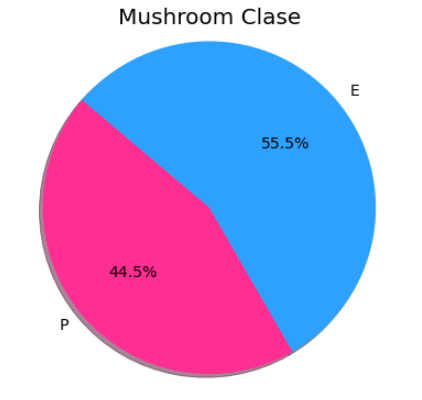
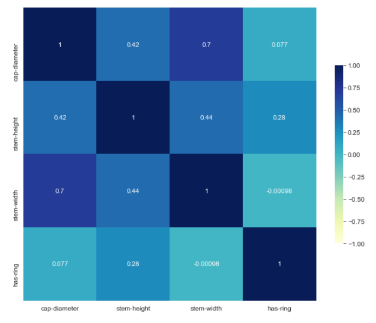
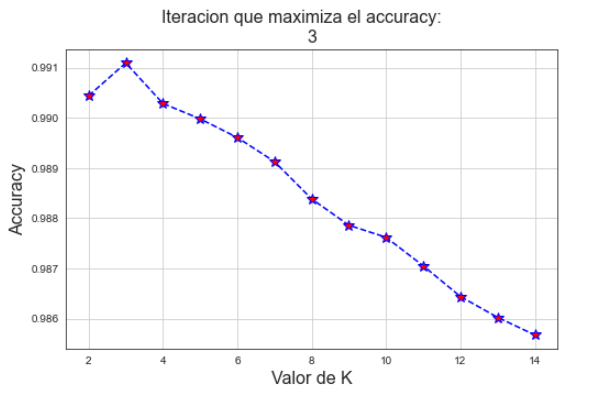
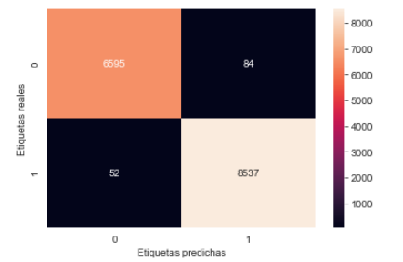

```{css my-header-colors, echo = FALSE}
.page-header {
    background-image: url('https://media0.giphy.com/media/1fgLkB8QIZO5KdQLL8/giphy.gif?cid=ecf05e47z44e2m8kas7bhs81wz9kof5q4jrec0dswgcd92nu&rid=giphy.gif&ct=g');
    border: solid 1px black;
    border-radius: .3rem;
    background-size: cover;
}

```

```{css , echo = FALSE}

.myimg {
  border: solid 1px black;
}

```


<style type="text/css">

.toc .toc-box {
    padding: 1.5rem;
    background-color: #f5f5f5;
    border: solid 1px #6b6b6b;
    border-radius: .3rem;
}

a {
    color: black;
    text-decoration: none;
    font-weight: bold;
}


.main-content h2, .main-content h3, .main-content h4, .main-content h5, .main-content h6 {
    margin-top: 2rem;
    margin-bottom: 1rem;
    font-weight: 400;
    color: black;
}


.main-content h1 {
    margin-top: 2rem;
    margin-bottom: 1rem;
    font-weight: 750;
    background-image: url('https://media0.giphy.com/media/1fgLkB8QIZO5KdQLL8/giphy.gif?cid=ecf05e47z44e2m8kas7bhs81wz9kof5q4jrec0dswgcd92nu&rid=giphy.gif&ct=g');
    background-position: center;
    color: white;
    text-align: center;
    border: solid 1px black;
    border-radius: .3rem;
    background-color: #f5f5f5;
} 


h1.title {
  font-size: 58px;
  color: white;
  text-align: center;
}
h3.subtitle { 
    font-size: 28px;
  font-family: "Times New Roman", Times, serif;
  color: white ;
  text-align: center;
}
h4.author { 
    font-size: 24px;
  font-family: "Times New Roman", Times, serif;
  color:white ;
  text-align: center;
}

.main-content table th {
    font-weight: 700;
    background-color: blue;
    color: rgb(255, 255, 255);
}


</style>

<br>
</br>


<div style="text-align: left" class="toc-box">
# 1 - Introduccion
</div>
<div style="text-align: right" class="toc-box">
 <a href="#top">Volver al Inicio</a>
</div>
<br>
</br>

```{r, echo=FALSE, out.width="45%", fig.align='center'}
knitr::include_graphics("https://c.tenor.com/RpShjXCcGiEAAAAC/trippy-mushroom.gif")
```

<br>
</br>

El siguiente trabajo consiste en realizar un modelo que clasifique lo mejor posible nuestros datos de hongos en venenosos y no venenosos. Luego del análisis exploratorio y limpieza de datos se va a entrenar un modelo de <span style="color:blue">*Knn Vecinos mas Cercanos*</span> que nos sirva para clasificar y poder predecir en base a nuevas features.


<br>
</br>


**_Librerías_**

Para utilizar código <span style="color:blue">*Python*</span> en R Markdown se usa la librería reticulate.
 
 
<br>
</br>

```{r}

library(reticulate)

Sys.setenv(RETICULATE_PYTHON = 'C:/ProgramData/Anaconda3/python.exe')

use_python('C:/ProgramData/Anaconda3/python.exe')

```


```{python, warning=FALSE}
import numpy as np
import pandas as pd
import seaborn as sb
import matplotlib.pyplot as plt
from sklearn.neighbors import KNeighborsClassifier
from sklearn.metrics import accuracy_score, recall_score, precision_score, f1_score
from sklearn.model_selection import train_test_split, cross_val_score, KFold
import matplotlib.pyplot as plt
import warnings
warnings.filterwarnings('ignore')

def colored(r, g, b, text):
        return "\033[38;2;{};{};{}m{} \033[38;2;255;255;255m".format(r, g, b, text)

```


<br>
</br>
<div style="text-align: left" class="toc-box">
# 2 - Descripcion del Modelo
</div>
<div style="text-align: right" class="toc-box">
 <a href="#top">Volver al Inicio</a>
</div>
<br>
</br>


<a id="section_knn"></a>


KNN es uno de los algoritmos más sencillos de _machine learning_. La famosa frase "dime con quién andas y te diré quién eres" tal vez sea la mejor explicación informal del algoritmo. Básicamente, KNN se encarga de memorizar la ubicación de cada muestra del conjunto de entrenamiento de acuerdo a los valores de sus _features_. Cuando recibe un dato nuevo, lo ubica en la posición del espacio que le corresponde según sus características y encuentra los _k_ vecinos más cercanos (_k_ es un hiperparámetro del modelo que define cuántos vecinos se van a considerar al momento de hacer las predicciones). Estos vecinos o puntos próximos son las muestras del conjunto de entrenamiento que resultan más similares a la observación que queremos clasificar. Una vez que se identificaron los _k_ vecinos más cercanos, cada uno de ellos aporta un "voto" a la clase a la que corresponde. La predicción queda determinada por la clase mayoritaria entre los _k_ vecinos más cercanos.


      
$$ p(y = c|x, D, k) = \frac{1}{k} \sum_{i \in N_k(x, D)} I(y_i = c) $$
donde $x$ es el vector de _features_ del dato a predecir, $D$ es el conjunto de datos de entrenamiento, _k_ es la cantidad de vecinos a evaluar en $D$, $N_k(x, D)$ son los índices de los _k_ vecinos más cercanos e $I(y_i = c)$ es una función indicadora que se define como

$I(e)=\left\{ \begin{array}{ll}  1\ si\ e\ es\ cierta\\  0\ si\ e\ es\ falsa\end{array}  \right.$

La clase con mayor probabilidad es la que será predicha.


<br>
</br>


<div style="text-align: left" class="toc-box">
# 3 - Limpieza de Datos 
</div>
<div style="text-align: right" class="toc-box">
 <a href="#top">Volver al Inicio</a>
</div>
<br>
</br>


```{python}
data_mush = 'secondary_data.csv'
data_hongo = pd.read_csv(data_mush, sep=';')
```


```{python}
data_hongo.info()
```


```{python}
data_hongo['has-ring'] = data_hongo['has-ring'].replace('f',0)
data_hongo['has-ring'] = data_hongo['has-ring'].replace('t',1)
data_hongo['has-ring'].value_counts()
```


```{python}
data_hongo.isnull().sum()
```


```{python}
lista = data_hongo.isnull().sum()
values = []
for i in range(len(lista)):
    if data_hongo.isnull().sum()[i] > 0:
        value = data_hongo.isnull().sum().index[i]
        values.append(value)
data_hongo.drop(columns = values, inplace = True)
```

<br>
</br>
<div style="text-align: left" class="toc-box">
# 4 - Visualizaciones
</div>
<div style="text-align: right" class="toc-box">
 <a href="#top">Volver al Inicio</a>
</div>
<br>
</br>


```{python}
from matplotlib import pyplot as plt
plt.figure(figsize=(6,6))
mush_size = data_hongo['class'].value_counts().values.tolist()
mush_types = data_hongo['class'].value_counts().axes[0].tolist()
mush_labels = 'E', 'P'
colors = ['#2ea1ff', '#ff2e93']

```

```{r, echo=FALSE, out.width="60%", fig.align='center'}

```


```{r, echo=FALSE, out.width="60%", fig.align='center'}

```


```{python}

import plotly.express as px

fig = px.scatter_3d(data_hongo, 
                    title = "3D Plot",
                    x = 'cap-diameter', 
                    y = 'stem-height', 
                    z = 'cap-shape', 
                    color = data_hongo['class'].astype('str'))
fig.update_layout(
                  width=600,
                  height=500)
#fig.show()

```

<br>
</br>
<div style="text-align: left" class="toc-box">
# 5 - Modelo
</div>
<div style="text-align: right" class="toc-box">
 <a href="#top">Volver al Inicio</a>
</div>
<br>
</br>


```{python}
data_hongo = pd.get_dummies(data_hongo, drop_first=True)
data_hongo.rename(columns={'class_p': 'class'}, inplace = True)

```


```{python}
X = data_hongo.drop(columns=['class'])
y = data_hongo['class']

X_train, X_test, y_train, y_test = train_test_split(X, y, random_state = 0)
```

Para poder comprender qué ocurre con el dilema entre sesgo y varianza conforme varía k, conviene pensar en las situaciones extremas:

• De mínima, el valor de k no puede ser inferior a 1, puesto que de ser igual a 0 no habría ningún vecino contra el que comparar a los datos nuevos (tampoco tendría mucho sentido hablar de identificar los -2 vecinos más cercanos, por ejemplo). Cuando k vale 1, el modelo va a estar "pegándose" demasiado a cada punto del set de entrenamiento, lo que lleva a una pérdida considerable de generalidad. Las "islas" azules dentro del área naranja que se observan en la primera figura son una clara representación de esta situación. Por esto, solemos asociar valores demasiado bajos de k con una alta varianza del modelo.

• De máxima, k no puede ser mayor al número se samples del conjunto de entrenamiento, ya que estaríamos pidiéndole al modelo que evalúe más puntos de los que conoce. Si k = n, el modelo sólo aprende a predecir la clase mayoritaria en el training set, de ahí que en la última figura de la grilla observemos que el área azul cubre todo el gráfico. Por esto, valores demasiado altos de k suelen asociarse a un alto sesgo del modelo.
Hallar un valor adecuado de k es un aspecto crucial al momento de trabajar con KNN. Para ello, será necesario trabajar con un esquema de cross-validation que nos permita elegir un k óptimo en base a múltiples pruebas.


```{python}
kf = KFold(n_splits = 5, shuffle = True, random_state = 12)

k_range = list(range(2,15))
scores = []
try:
    for i in k_range:
        knn = KNeighborsClassifier(n_neighbors = i)
        cv_scores = cross_val_score(knn, X_train, y_train, cv = kf)
        scores.append(np.mean(cv_scores))
except Exception as e:
    print(e)
    print(colored(238, 75, 43, '\nPide otra version de numpy para este algoritmo'))
```


```{r, echo=FALSE, out.width="60%", fig.align='center'}

```

```{python}
knn = KNeighborsClassifier(n_neighbors=3)
knn.fit(X_train, y_train)
accuracy_score(y_test, knn.predict(X_test))
```

```{python}
from sklearn.metrics import confusion_matrix

y_pred = knn.predict(X_test)
```

```{r, echo=FALSE, out.width="60%", fig.align='center'}

```

```{python}
confusion = confusion_matrix(y_test, y_pred)

def get_metrics(y_test, y_pred, model):
    accuracy = accuracy_score(y_test, y_pred).round(3)
    recall   = recall_score(y_test, y_pred).round(3)
    precision= precision_score(y_test, y_pred).round(3)
    f_1      = f1_score(y_test, y_pred).round(3)
    metrics  = f"\n\nAccuracy:  {accuracy}\nRecall:    {recall}\nPrecision: {precision}\nf1 Score:  {f_1}."
    return print(colored(0, 75, 43, 'Modelo: ' + model), colored(238, 75, 43, metrics))

get_metrics(y_test, y_pred, 'Knn')
```

<br>
</br>
<div style="text-align: left" class="toc-box">
# 6 - Conclusiones
</div>
<div style="text-align: right" class="toc-box">
 <a href="#top">Volver al Inicio</a>
</div>
<br>
</br>


El modelo Knn tiene un accuracy del 99 %. Se comprobó que el accuracy de los datos de entrenamiento como testeo es casi el mismo, por lo tanto, podemos concluir que no solo es un buen modelo sino también no se encuentra sobre ajustado.

Este modelo nos sirve para clasificar y predecir en base a futuras features que tengamos sobre hongos.


